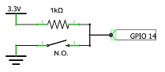

# bButtons Library
## Overview
A bButton allows you to easily manage button's events like click, double-click and long-press. It is a specilized version of [bSensor](https://github.com/diy365-mgos/bsensor).
## Features
- **GPIO as buttons** - You can easily manage buttons attached to input GPIOs. Just include the [bThings GPIO library](https://github.com/diy365-mgos/bthing-gpio) in your project.
## Get Started in C/C++
Include the library in your `mos.yml` file.
```yaml
libs:
  - origin: https://github.com/diy365-mgos/bbutton
```
#### Example 1 - Dash button
Create a dash button. Before running the code sample, you must wire your boardas indicated in the schema below.



In addition, include this library in your `mos.yml` file.
```yaml
libs:
  - origin: https://github.com/diy365-mgos/bvar-json
  - origin: https://github.com/diy365-mgos/bthing-gpio
```
```c
#include "mgos.h"
#include "mgos_bvar_json.h"
#include "mgos_bthing_gpio.h"
#include "mgos_bbutton.h"

static int gpio_pin = 14;

static void button_state_changed_cb(int ev, void *ev_data, void *userdata) {
  struct mgos_bthing_state_changed_arg *arg = (struct mgos_bthing_state_changed_arg *)ev_data;

  char *json = json_asprintf("%M", json_printf_bvar, arg->state);
  LOG(LL_INFO, ("Button '%s' state: %s", mgos_bthing_get_id(arg->thing), json));
  free(json);
}

static void button_on_event_cb(mgos_bbutton_t btn, enum mgos_bbutton_event ev, void *userdata) {
  mgos_bthing_t thing = MGOS_BBUTTON_THINGCAST(btn);
  const char *id = mgos_bthing_get_id(thing);

  switch (ev) {
    case MGOS_EV_BBUTTON_ON_CLICK:
      LOG(LL_INFO, ("Button '%s' event: ON-CLICK", id));
      break;
    case MGOS_EV_BBUTTON_ON_DBLCLICK:
      LOG(LL_INFO, ("Button '%s' event: ON-DBLCLICK", id));
      break;
    case MGOS_EV_BBUTTON_ON_PRESS:
      LOG(LL_INFO, ("Button '%s' event: ON-PRESS", id));
      break;
    case MGOS_EV_BBUTTON_ON_RELEASE:
      LOG(LL_INFO, ("Button '%s' event: ON-RELEASE", id));
      break;
    case MGOS_EV_BBUTTON_ON_IDLE:
      LOG(LL_INFO, ("Button '%s' event: ON-IDLE", id));
      break;
    default:
      break;
  }
} 

enum mgos_app_init_result mgos_app_init(void) {
  mgos_event_add_handler(MGOS_EV_BTHING_STATE_CHANGED, button_state_changed_cb, NULL);

  /* create the sensor */
  mgos_bbutton_t btn = mgos_bbutton_create("btn1");
  /* attach GPIO  */
  mgos_bthing_gpio_attach(MGOS_BBUTTON_THINGCAST(btn), gpio_pin, false, true);
  /* set the event handler callback */
  mgos_bbutton_on_event(btn, button_on_event_cb, NULL);

  return MGOS_APP_INIT_SUCCESS;
}
```
## C/C++ APIs Reference
### Inherited APIs
A bButton inherits APIs from:
- [bThing](https://github.com/diy365-mgos/bthing)
- [bSensor](https://github.com/diy365-mgos/bsensor)
#### Remarks on (*mgos_bthing_get_state_handler_t)
The [*get-state* handler](https://github.com/diy365-mgos/bthing#mgos_bthing_get_state_handler_t) of a bButton must return a boolean [bVariant](https://github.com/diy365-mgos/bvar): `true` if the physical button is pressed, or `false` otherwise.

Example
```c
static bool btn_get_state_handler(mgos_bthing_t thing, mgos_bvar_t state, void *userdata) {
  bool is_pressed;
  // ... check if the physical button is pressed
  mgos_bvar_set_bool(state, is_pressed);
  return true;
}
```
#### Remarks on mgos_bthing_get_state
The inherited [mgos_bthing_get_state()](https://github.com/diy365-mgos/bthing#mgos_bthing_get_state) returns a [bVariantDictionary](https://github.com/diy365-mgos/bvar-dic) having following keys:
|Key|Type||
|--|--|--|
|event|integer|The last [event](https://github.com/diy365-mgos/bbutton#mgos_bbutton_event) occurred: 1(`MGOS_EV_BBUTTON_ON_IDLE`), 2(`MGOS_EV_BBUTTON_ON_CLICK`), 3(`MGOS_EV_BBUTTON_ON_DBLCLICK`), 4(`MGOS_EV_BBUTTON_ON_PRESS`) or 5(`MGOS_EV_BBUTTON_ON_RELEASE`).|
|pressCount|integer|The press (long-press) counter or `0` in case the button was just clicked or double-clicked. The same returned by `mgos_bbutton_get_press_count()`.|
|pressDuration|integer|The press (long-press) duration in milliseconds, or `0` in case the button was just clicked or double-clicked. The same returned by `mgos_bbutton_get_press_duration()`.|
### MGOS_BBUTTON_TYPE
```c
#define MGOS_BBUTTON_TYPE 16
```
The bButton type ID returned by [mgos_bthing_get_type()](https://github.com/diy365-mgos/bthing#mgos_bthing_get_type). It can be used with [mgos_bthing_is_typeof()](https://github.com/diy365-mgos/bthing#mgos_bthing_is_typeof).

Example:
```c
mgos_bbutton_t btn = mgos_bbutton_create(...);
if (mgos_bthing_is_typeof(MGOS_BBUTTON_THINGCAST(btn), MGOS_BBUTTON_TYPE))
  LOG(LL_INFO, ("I'm a bButton."));
if (mgos_bthing_is_typeof(MGOS_BBUTTON_THINGCAST(btn), MGOS_BSENSOR_TYPE))
  LOG(LL_INFO, ("I'm a bSensor."));
if (mgos_bthing_is_typeof(MGOS_BBUTTON_THINGCAST(btn), MGOS_BTHING_TYPE_SENSOR))
  LOG(LL_INFO, ("I'm a bThing sensor."));
```
Output console:
```bash
I'm a bButton.
I'm a bSensor.
I'm a bThing sensor.
```
### mgos_bbutton_event
```c
enum mgos_bbutton_event {
  MGOS_EV_BBUTTON_ANY,
  MGOS_EV_BBUTTON_ON_IDLE,
  MGOS_EV_BBUTTON_ON_CLICK,
  MGOS_EV_BBUTTON_ON_DBLCLICK,
  MGOS_EV_BBUTTON_ON_PRESS,
  MGOS_EV_BBUTTON_ON_RELEASE
};
```
A bButton publishes these events, so you can subcribe to them using `mgos_event_add_handler()`.

|Event||
|--|--|
|MGOS_EV_BBUTTON_ANY|Subscribe to this event using `mgos_event_add_group_handler()` for listening to all events.|
|MGOS_EV_BBUTTON_ON_IDLE|Published when the bButton returns back to the idle state.|
|MGOS_EV_BBUTTON_ON_CLICK|Published when the bButton is clicked (single-click).|
|MGOS_EV_BBUTTON_ON_DBLCLICK|Published when the bButton is double-clicked.|
|MGOS_EV_BBUTTON_ON_PRESS|Published when the bButton is pressed (long-press).|
|MGOS_EV_BBUTTON_ON_RELEASE|Published when the bButton is released after a long-press.|
### MGOS_BBUTTON_THINGCAST
```c
mgos_bthing_t MGOS_BBUTTON_THINGCAST(mgos_bbutton_t button);
```
Casts a bButton to a generic bThing to be used with [inherited bThing APIs](https://github.com/diy365-mgos/bthing).

|Parameter||
|--|--|
|button|A bButton.|

Example:
```c
mgos_bbutton_t btn = mgos_bbutton_create(...);
LOG(LL_INFO, ("%s successfully created.", mgos_bthing_get_id(MGOS_BBUTTON_THINGCAST(btn)));
```
### MGOS_BBUTTON_DOWNCAST
```c
mgos_bsensor_t MGOS_BBUTTON_DOWNCAST(mgos_bbutton_t button);
```
Casts a bButton to a bSensor to be used with [inherited bSensor APIs](https://github.com/diy365-mgos/bsensor).

|Parameter||
|--|--|
|button|A bButton.|
### mgos_bbutton_create
```c
mgos_bbutton_t mgos_bbutton_create(const char *id);
```
Creates a bButton. Returns `NULL` on error.

|Parameter||
|--|--|
|id|The bButton ID.|
### mgos_bbutton_is_pressed
```c
bool mgos_bbutton_is_pressed(mgos_bbutton_t button);
```
Returns `true` if the bButton is pressed (long-press), or `false` otherwise.

|Parameter||
|--|--|
|button|A bButton.|
### mgos_bbutton_get_press_duration
```c
int mgos_bbutton_get_press_duration(mgos_bbutton_t button);
```
Returns how long the button has been pressed (long-press), in milliseconds.

|Parameter||
|--|--|
|button|A bButton.|
### mgos_bbutton_get_press_count
```c
int mgos_bbutton_get_press_count(mgos_bbutton_t button);
```
Returns the counter since the button has been pressed (long-press). The counter is increased every `press_repeat_ticks` milliseconds if a value greater than `0` was provided.

|Parameter||
|--|--|
|button|A bButton.|
### (*mgos_bbutton_event_handler_t)
```c
typedef void (*mgos_bbutton_event_handler_t)(mgos_bbutton_t button,
                                             enum mgos_bbutton_event ev,
                                            void *userdata);
```
Event handler signature (see [mgos_bbutton_on_event()](#mgos_bbutton_on_event) below). 

|Parameter||
|--|--|
|button|A bButton.|
|ev|The triggered [event](#mgos_bbutton_event).|
|userdata|The handler's *user-data*.|
### mgos_bbutton_on_event
```c
bool mgos_bbutton_on_event(mgos_bbutton_t button,
                           mgos_bbutton_event_handler_t on_event_cb,
                           void* userdata);
```
Adds an [event handler](#mgos_bbutton_event_handler_t) to a bButton. 

|Parameter||
|--|--|
|button|A bButton.|
|on_event_cb|The [event handler](#mgos_bbutton_event_handler_t) or NULL to reset the handler.|
|userdata|The *user-data* to pass to the handler or `NULL`. Ignored if `on_event_cb` is `NULL`.|
### mgos_bbutton_cfg
```c
struct mgos_bbutton_cfg {
  int click_ticks;
  int press_ticks;
  int press_repeat_ticks;
  int debounce_ticks;
};
```
bButton configuration parameters.

|Parameter||
|--|--|
|click_ticks|Single click duration, in milliseconds.|
|press_ticks|Long-press duration, in milliseconds.|
|press_repeat_ticks|Interval, in milliseconds, for raising multiple `MGOS_EV_BBUTTON_ON_PRESS` events, subsequent to the first one.|
|debounce_ticks|Debounce interval in milliseconds. `0` means no-debounce.|
### mgos_bbutton_set_cfg
```c
bool mgos_bbutton_set_cfg(mgos_bbutton_t button, struct mgos_bbutton_cfg *cfg);
```
Sets bButton configuration. Returns `true` on success, or `false` otherwise.

|Parameter||
|--|--|
|button|A bButton.|
|cfg|[Configuration parameters](#mgos_bbutton_cfg).|

**Remarks**

You can set parameter values to `-1` for using defaults:

|Parameter|Defualt|
|--|--|
|click_ticks|`MGOS_BBUTTON_DEFAULT_CLICK_TICKS` (600 ms).|
|press_ticks|`MGOS_BBUTTON_DEFAULT_PRESS_TICKS` (1 s).|
|press_repeat_ticks|`MGOS_BBUTTON_DEFAULT_PRESS_TICKS` (1 s).|
|debounce_ticks|`MGOS_BBUTTON_DEFAULT_DEBOUNCE_TICKS` (50 ms).|
### mgos_bbutton_get_cfg
```c
bool mgos_bbutton_get_cfg(mgos_bbutton_t button, struct mgos_bbutton_cfg *cfg);
```
Gets bButton configuration. Returns `true` on success, or `false` otherwise.

|Parameter||
|--|--|
|button|A bButton.|
|cfg|Output [configuration parameters](#mgos_bbutton_cfg).|
## To Do
- Implement javascript APIs for [Mongoose OS MJS](https://github.com/mongoose-os-libs/mjs).